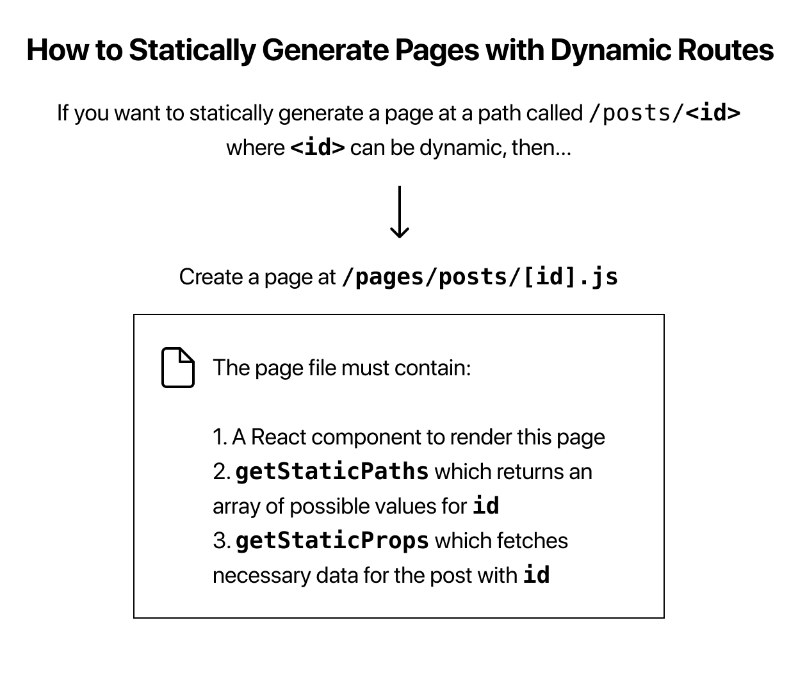

- fist we need a function to get all posts slug
  ==>and we need to confirm which slug has been used in current web url
  ==>then we use this slug to fetch the data and render 
the function get all slug (here are Ids: they are the same, but the variable name must be the same as \[id or slug \].js)
```jsx
export function getAllPostIds() {
  const fileNames = fs.readdirSync(postsDirectory);

  // Returns an array that looks like this:
  // [
  //   {
  //     params: {
  //       id: 'ssg-ssr'
  //     }
  //   },
  //   {
  //     params: {
  //       id: 'pre-rendering'
  //     }
  //   }
  // ]
  return fileNames.map((fileName) => {
    return {
      params: {
        id: fileName.replace(/\.md$/, ''),
      },
    };
  });
}
```
	this function use file's name as their's

ok we get all possible slug, now we need to confirm which the url is pointing,
```js
import { getAllPostIds } from '../../lib/posts';

export async function getStaticPaths() {
  const paths = getAllPostIds();
  return {
    paths,
    fallback: false,
  };
}
```

it return all the paths possible, I don't know the details but I guess the mechanism behind will choose the right one, and send it slug to getData function
```jsx
export function getPostData(id) {
  const fullPath = path.join(postsDirectory, `${id}.md`);
  const fileContents = fs.readFileSync(fullPath, 'utf8');

  // Use gray-matter to parse the post metadata section
  const matterResult = matter(fileContents);

  // Combine the data with the id
  return {
    id,
    ...matterResult.data,
  };
}
```

```js
import { getAllPostIds, getPostData } from '../../lib/posts';

export async function getStaticProps({ params }) {
  const postData = getPostData(params.id);
  return {
    props: {
      postData,
    },
  };
}
```


```jsx
export default function Post({ postData }) {
  return (
    <Layout>
      {postData.title}
      <br />
      {postData.id}
      <br />
      {postData.date}
    </Layout>
  );
}
```