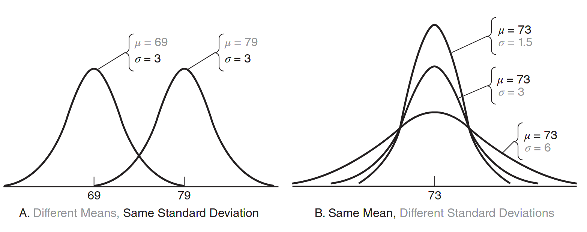

“as any change in the value of either the mean or the standard deviation (or both) would create a new normal curve that no longer describes the original distribution” ([⁨Witte⁩ and ⁨Witte⁩, 2017, p. 85](zotero://select/library/items/ZCQCSGM8)) ([pdf](zotero://open-pdf/library/items/YYSEUUXR?page=103&annotation=5Z65335C)) 🔤任何改变的价值意味着或标准偏差(或两者)将创建一个新的正常曲线不再描述了原分布🔤

in my opinion the mean just the positon of the curve on the horizontal axis, and the deviation is the tall or flat shape of the curve.
