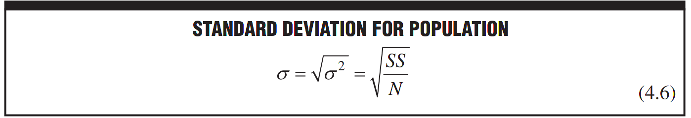
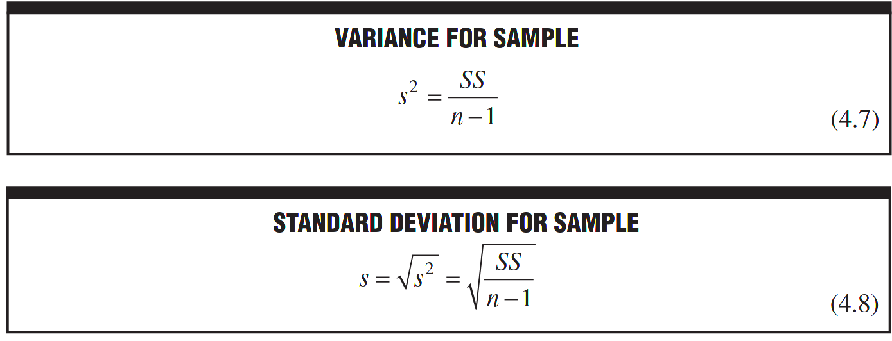

>there is a small but important change in the formulas for the variance and standard deviation for samples. This change appears in the denominator of each formula where N, the population size, is replaced not by n, the sample size, but by n − 1, as shown:

- you have to know that the symbols for standard deviation are also different, sigma for population and lower case s for sample
- you may ask [[why_we_use_N-1_rather_than_N_in_standard_deviation_in_sample]]