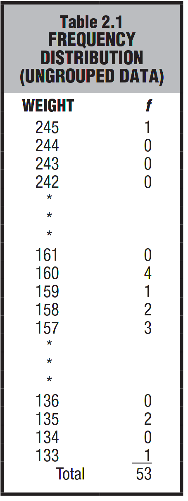

- “When observations are sorted into classes of single values, as in Table 2.1, the result is referred to as a frequency distribution for ungrouped data.” ([⁨Witte⁩ and ⁨Witte⁩, 2017, p. 23](zotero://select/library/items/ZCQCSGM8)) ([pdf](zotero://open-pdf/library/items/YYSEUUXR?page=41&annotation=E35QZ3PU)) 🔤当观测值被分类为单值类别时（如表 2.1 所示），结果被称为未分组数据的频率分布。🔤

- “When observations are sorted into classes of more than one value, as in Table 2.2, the result is referred to as a frequency distribution for grouped data.” ([⁨Witte⁩ and ⁨Witte⁩, 2017, p. 24](zotero://select/library/items/ZCQCSGM8)) ([pdf](zotero://open-pdf/library/items/YYSEUUXR?page=42&annotation=P9JVPJT4)) 🔤当观测值被分类为多个值的类别时（如表 2.2 所示），结果被称为分组数据的频率分布。🔤